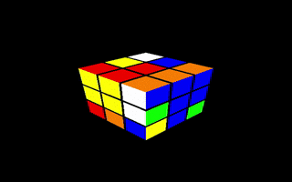

# asocial-aardvark: Software Systems, Spring 2017
## Creating a graphical Rubik's cube in C++ and solving it using threading and depth-first search in C

An implementation of a Rubik’s cube solver with a graphical interface. As a final deliverable, a 3x3 cube is displayed and solved. The cube is displayed using OpenGL and C++ code. The solving portion of the cube is done in C and leverages threading and depth-first search (creating 9 threads and solving each individual one based on an initial rotate move). Threading is used to speed up the general process. A complete writeup of our project can be found here:
### [Final Report Website]()

## Authors:
[Hieu Nguyen](https://github.com/thecardkid), [David Papp](https://github.com/davpapp), [Philip Seger](https://github.com/segerphilip), [Sarah Walters](https://github.com/sarahwalters)

[Information concerning cube rotation notation](https://ruwix.com/the-rubiks-cube/notation/)

## Getting started:
Required packages (tested on Ubuntu 14.04):
- g++
- build-essential
- freeglut3-dev

For a complete install on ubuntu, run:
`sudo apt-get install -y g++ build-essential freeglut3-dev`

To run, type `make` in the top directory.

## Usage:
Keyboard commands:
- x: scramble the cube
- l: rotate the left face
- r: rotate the right face
- u: rotate the upper face
- d: rotate the bottom face
- f: rotate the front face
- b: rotate the back face
- m: rotate right middle face
- e: rotate middle middle face
- s: rotate left middle face
- t: create threads to solve the cube
- q: quit
- arrow keys: rotate the view of the cube

## License:
[MIT License](LICENSE)
