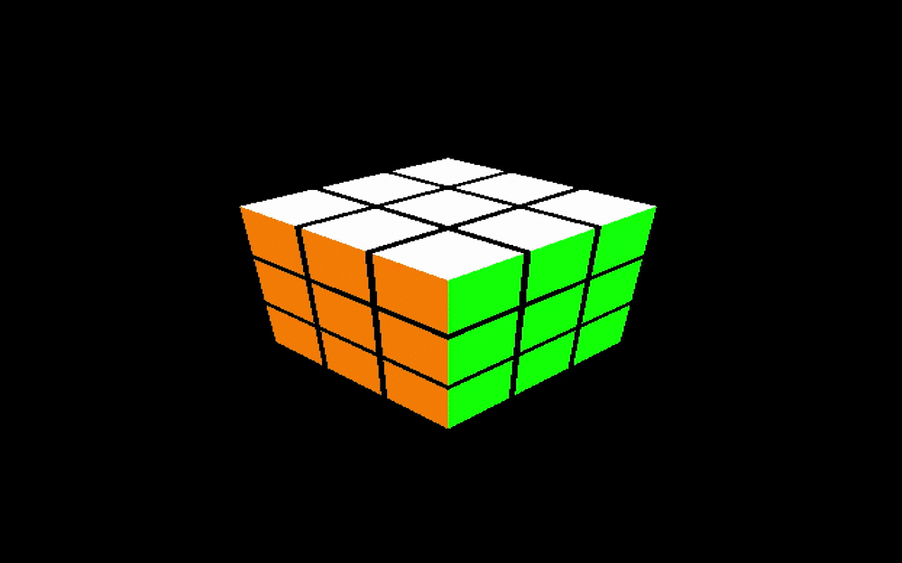

# Project 1 Preliminary Report

## Overview
We’re planning to build a Rubik’s cube solver with a graphical interface. As a lower bound, we’d like to be able to display and solve a 3x3 cube; as an upper bound, we’d like to generalize to displaying and solving any (maybe “any up to n”) size of cube. We’re interested in exploring concurrency / threading, which 3x3 algorithms don’t really require (it’s known that any cube configuration can be solved in 20 moves, and there are detailed algorithms for solving in less than 52 moves). Generalizing to solve nxn cubes might require using a tree-based algorithm which relies on concurrency.

## Completed Tasks

Graphical implementation: [code](https://github.com/thecardkid/SoftSysAsocialAardvark/blob/master/src/Graphics.cpp)
- Render a static hard-coded 3x3 3D cube
- Cube sides rotation
- View rotation
- Mouse rotation prototype

Cube API: [code](https://github.com/thecardkid/SoftSysAsocialAardvark/blob/master/src/RubiksCube.cpp)

Integration:
- Glue the cube API to the graphical implementation ([happens in the main method](https://github.com/thecardkid/SoftSysAsocialAardvark/blob/master/src/main.cpp#L70))
- [Keyboard controls](https://github.com/thecardkid/SoftSysAsocialAardvark/blob/master/src/main.cpp#L36)

Process:
- [Set up a makefile](https://github.com/thecardkid/SoftSysAsocialAardvark/blob/master/Makefile)
- [Set up a linter](https://github.com/thecardkid/SoftSysAsocialAardvark/blob/master/CPPLINT.cfg)
- [Cube API tests](https://github.com/thecardkid/SoftSysAsocialAardvark/tree/master/tests) which run every time the project builds, in the [main method](https://github.com/thecardkid/SoftSysAsocialAardvark/blob/master/src/main.cpp#L70)

Readings:
- HFC chapters 1-4
- ThinkOS chapters 1-4

## Preliminary Results

## Annotated Resource List

- [How to solve a Rubik’s cube](http://dougandmarsha.com/Rubiks_Cube_Users_Guide.pdf)
	Instructions on how to go about solving a Rubik’s cube.
- [Thistlethwaite’s 52 move algorithm](https://www.jaapsch.net/puzzles/thistle.htm)
Explanation of the stages of Thistlethwaite’s solution, the size of the lookup tables required for each stage, and the intuition behind them.
- [20 move solution](http://kociemba.org/cube.htm)
Implementation explaining how the fastest solution to a Rubik’s cube is in 20 moves. If we can get close to this number then that would mean we have a pretty efficient and well built algorithm for solving any randomly generated cube.
- [General introductory reference on OpenGL](http://www.glprogramming.com/red/chapter01.html) This tutorial describes OpenGL’s capabilities, gives a high-level overview of its rendering pipeline, points to common libraries, and explains double-buffered animation.
- [Tutorial for rotation in a plane](http://www.lighthouse3d.com/tutorials/glut-tutorial/mouse-putting-it-all-together/) This tutorial provides an example of triggering events upon mouse click / mouse motion in OpenGL and describes how to set up ground plane rotation upon mouse drag.

## Product Backlog

- Brute force search of all possible solutions (maybe with limited depth)
- Multithreading optimization
- HFC chapters 10 & 12
- ThinkOS chapters 8, 9, & 11
- Solve nxnxn cubes (this is a stretch goal)

## Potential roadblocks

- We’ve been struggling to figure out how to pass C++ objects/things to a C function
- Moving forward, we need to learn all about multithreading and thread safety in C.
