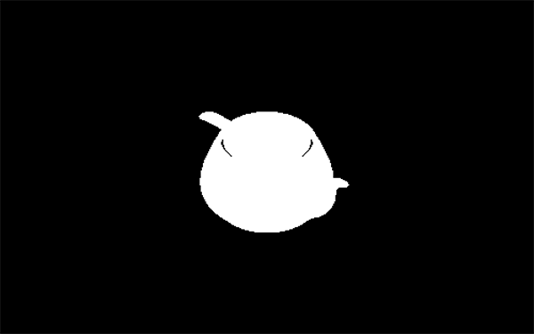
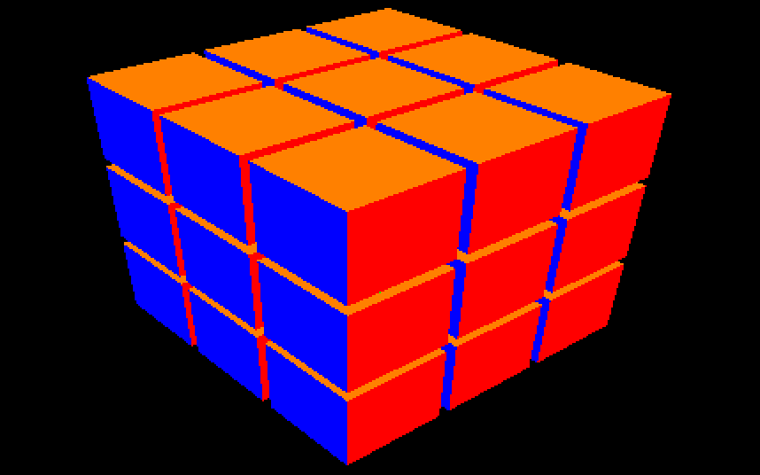
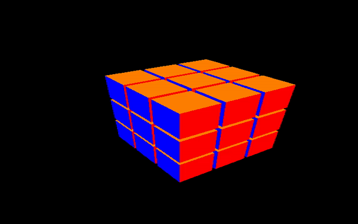

# AsocialAardvark - Project Proposal

1) State the goal of your project, ideally including a lower bound you are confident you can achieve and a stretch goal that is more ambitious.

- We’re planning to build a Rubik’s cube solver with a graphical interface. As a lower bound, we’d like to be able to display and solve a 3x3 cube; as an upper bound, we’d like to generalize to displaying and solving any (maybe “any up to n”) size of cube. We’re interested in exploring concurrency / threading, which 3x3 algorithms don’t really require (it’s known that any cube configuration can be solved in 20 moves, and there are detailed algorithms for solving in less than 52 moves). Generalizing to solve nxn cubes might require using a tree-based algorithm which relies on concurrency.

2) Demonstrate that you have acquired the knowledge you need to get started.  We will know that you have this knowledge if the text of the proposal uses domain language effectively to convey ideas clearly and concisely.

- Decision concerning using OpenGL
    - OpenGL abstracts away the lowest level graphics operations, providing wrapper functions which manage geometric primitives (points, lines, and polygons). Manipulating the geometric primitives directly would probably be reasonable for our application (Rubik’s cubes are fairly geometrically simple), but our code will be simpler and easier to maintain if we rely on some of the libraries which further abstract on top of OpenGL -- for example, the GL utility toolkit (GLUT) provides functions which draw three-dimensional solids like cubes. We considered alternatives to OpenGL (OGRE and Vulkan) but decided that OpenGL had the best documentation and the most tutorials & examples.
- Images of early graphics implementation (cube, camera movement)
    - 
    - 
    - 
    - 
    - Initially, work was started by attempting to implement graphics using Ogre as well as graphics.h (an early implementation in C). However, we quickly realized that OpenGL works well in C++, and we could use that side of things for our graphical implementation and make the logic in C. Some of our test graphics are shown, first just simply drawing an object. The next image is the image, however we are able to position the camera using the mouse. Finally, we implemented a cube using OpenGL and we could spin it around in the window.
- Explored optimized solution to 3x3x3 cube (Thistlethwaite’s 52 move algorithm)
    - Thistlethwaite's solution works on all pieces concurrently. It groups all possible cube permutations into four stages by using lookup tables. These lookup tables are in the realm of 2^16 permutations, which makes this approach impossible for humans. In the first stage, the orientation of the edge pieces are fixed. Since there are 12 edges with  and we start with one edge, this requires a lookup table of size 2^11. The other 3 stages follow a similar schematic but instead focus on the reorienting the corners, placing the edges into their correct slice, and so on.
    - There exist further optimized solutions that rely on even greater lookup tables. It has been proven that 20 move solutions exist. At this point, the solution is abstracted even further from visualization and intuition and thus this is likely beyond our scope.
- Explore basics of multithreading and concurrency in C; this includes learning about mutexes, semaphores, thread safety, and syntax.
    - We’ve learned a bit about mutexes and semaphores:
        - Any thread can lock a mutex, and any subsequent attempt to lock the mutex will block the attempting thread until the mutex is unlocked; generally only the original locking thread should be allowed to unlock the mutex.
        - Semaphores work like mutexes, but instead of maintaining a boolean which represents whether the mutex is locked or unlocked, they maintain a counter which accessing threads can decrement (“down”). Once the counter reaches 0, the semaphore is locked, and any subsequent attempt to decrement the counter will block the attempting thread until the counter is increased (“upped”) again. A mutex is a special case of a semaphore -- a semaphore with count 1.
    - We’re thinking that, if we were using a tree-based algorithm with concurrency to solve a larger-than-3x3 cube, we’d mutex the variables which keep track of the best solution path we’ve seen so far -- we don’t want two paths to be able to update the best solution path simultaneously.

3) Demonstrate that you have assembled the resources you need to get started.  One good way to do that is to include an annotated bibliography with a pointer to each resource and a few sentences that describe the content.
- [How to solve a Rubik’s cube](http://dougandmarsha.com/Rubiks_Cube_Users_Guide.pdf): Instructions on how to go about solving a Rubik’s cube.
- [Thistlethwaite’s 52 move algorithm](https://www.jaapsch.net/puzzles/thistle.htm): Explanation of the stages of Thistlethwaite’s solution, the size of the lookup tables required for each stage, and the intuition behind them.
- [20 move solution](http://kociemba.org/cube.htm): Implementation explaining how the fastest solution to a Rubik’s cube is in 20 moves. If we can get close to this number then that would mean we have a pretty efficient and well built algorithm for solving any randomly generated cube.
- [General introductory reference on OpenGL](http://www.glprogramming.com/red/chapter01.html): This tutorial describes OpenGL’s capabilities, gives a high-level overview of its rendering pipeline, points to common libraries, and explains double-buffered animation.
- [Tutorial for rotation in a plane](http://www.lighthouse3d.com/tutorials/glut-tutorial/mouse-putting-it-all-together/): This tutorial provides an example of triggering events upon mouse click / mouse motion in OpenGL and describes how to set up ground plane rotation upon mouse drag.

4) Present a product backlog for the next two sprints that represents a concrete plan that will keep the entire team productively engaged (this can be a link to your Trello board).  Each item in the product backlog should represent a good sized unit of work, and have an appropriate definition of done.
- [Trello for backlog](https://trello.com/b/4cSUD6m5/softsysasocialaardvark)

5) Enumerate potential roadblocks and ways instructors can help.  Do you need materials?  Do you have show-stopping questions you have not been able to answer?
- We’re a little concerned about gluing the graphics and the OOP representation of the Rubik’s cube (both of which we’re planning to write in C++) to the logic (which we’d like to write in C). As such, we’re approaching integration early: our goal for the first sprint is to set up a solid, well-integrated basis to build on.
